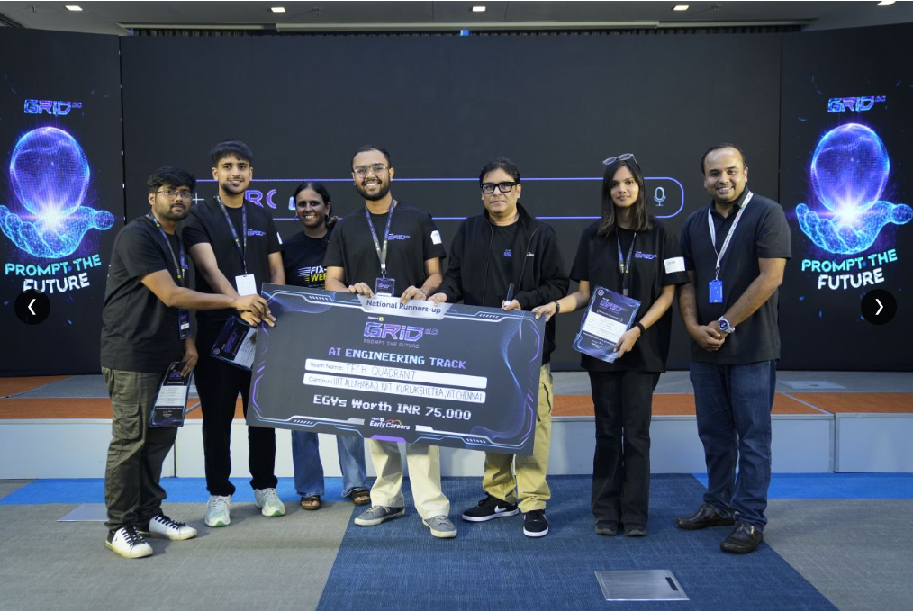

  

<h1 align="center">Hi, I'm Shubham Baghel 👋</h1>

  <strong>AI/ML Engineer · Generative AI · NLP · Agentic Systems</strong> 
  B.Tech. Artificial Intelligence and Machine Learning · NIT Kurukshetra

  <a href="https://shubham-baghel-portfolio.vercel.app">Portfolio</a> ·
  <a href="https://www.linkedin.com/in/shubham-baghel-478266310/">LinkedIn</a> ·
  <a href="mailto:shubhambaghel307@gmail.com">Email</a>

## 🚀 What I'm building

### Prognova Health — medical-travel and care-coordination platform

I am building Prognova Health to make medical travel to India clearer, more personalized, and easier to coordinate. The platform is designed around a conversational experience where **Nova** can listen or chat with a patient, understand their needs, collect the information required for a careful search, and help them explore treatment and support options based on:

- Medical service and treatment needs from verified hospital partners
- Budget, preferred comfort level, stay, transfers, companion support, and language needs
- Medical-visa guidance and travel-readiness support
- Transparent separation of clinical treatment costs and travel logistics
- Customizable packages that patients can review and shape before confirmation
- A connected patient journey from first question through return and follow-up

The product roadmap also includes a secure multi-method payment experience with Stripe and PayPal, milestone-based payment workflows, patient reviews, consent-based patient stories, and treatment- and destination-specific educational content. Prognova is being developed with clinical boundaries, privacy, provider verification, and honest confirmation states at the center.

## 🏆 Highlights

- **Flipkart GRiD 8.0 National Runner-Up — AI Engineering Track**
  - Built an agentic conversational shopping assistant with LLM intent extraction, session-aware state, deterministic tool routing, hybrid retrieval, and multilingual voice search.
  - Achieved **Slot F1 0.985**, **NDCG@5 0.651**, and **Task Completion 0.98** with hallucination rate below 0.1% in the reported evaluation.
- **Flipkart GRiD 8.0 Product Winner — Smart India Hackathon, NIT Kurukshetra**
- **Generative AI / NLP Intern — Sukh Sagar Projects Pvt. Ltd.**
  - Built an HR resume-shortlisting agent using LangGraph, bulk PDF/DOCX parsing, hybrid vector and keyword retrieval, and structured JSON/CSV outputs.
  - Designed an MCP tool framework with zero-secret retrieval, enforced validation checks, and cross-source consistency controls.
  - Improved large-scale resume processing to achieve a reported **4.83× speedup** through batching and parallelization.
- **Competitive programming:** Global ranks **211, 508, and 312** in CodeChef contests; rank **1743** in LeetCode Biweekly Contest 167.

## 🧠 Selected projects

- **Flipkart GRiD 8.0 — Conversational Shopping Agent** — Agentic shopping assistant with hybrid retrieval, deterministic routing, multilingual voice search, and session-aware context.
- **Mini GPT** — Built a 124M-parameter transformer from scratch in PyTorch, including tokenization, multi-head self-attention, positional embeddings, residual connections, and layer normalization; trained it on Shakespeare text.
- **Stable Diffusion XL Facial Aging System** — Fine-tuned DreamBooth LoRA with CLIP text encoding, prompt-driven age progression, and VAE-based reconstruction using Hugging Face Diffusers.
- **Prognova Health** — Conversational medical-travel discovery, customizable care logistics, provider coordination, visa support, journey planning, and a planned secure payment layer.

## 🛠️ Technical focus

**Languages:** Python, C++, SQL  
**AI/ML:** Machine Learning, Deep Learning, Generative AI, LLMs, RAG, Agentic AI, NLP, Prompt Engineering  
**Frameworks:** PyTorch, TensorFlow, Hugging Face, LangChain, LangGraph, scikit-learn, NumPy, Pandas  
**Platforms & tools:** Streamlit, Django, SQLite, REST APIs, Git, GitHub, VS Code, Jupyter, Google Colab  
**Advanced:** Transformer architectures, diffusion models, LoRA fine-tuning, embeddings, hybrid retrieval

## 📫 Connect

- [Portfolio](https://shubham-baghel-portfolio.vercel.app)
- [LinkedIn](https://www.linkedin.com/in/shubham-baghel-478266310/)
- [Email](mailto:shubhambaghel307@gmail.com)

  <i>Building practical AI systems that make complex decisions clearer and more useful.</i>

